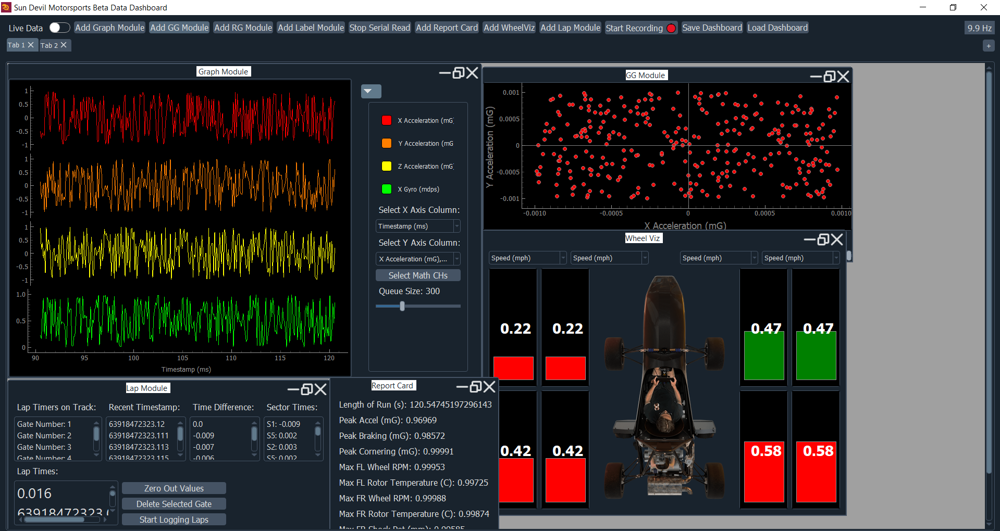
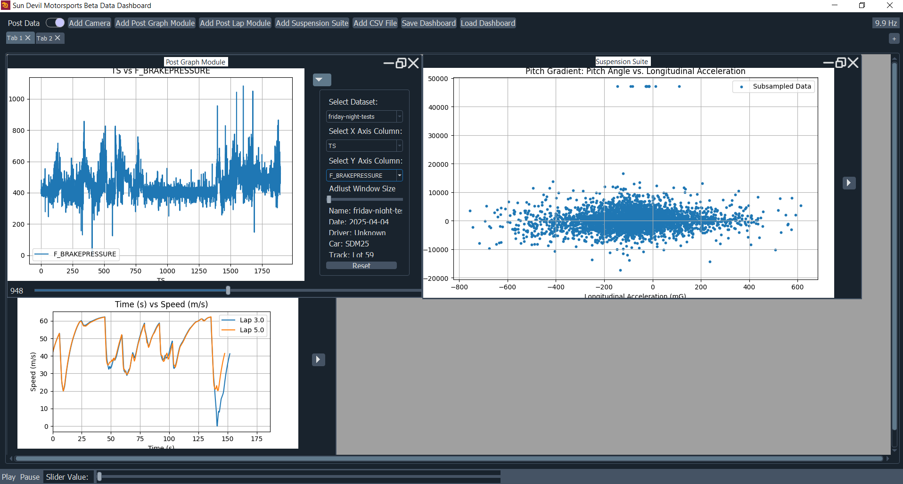
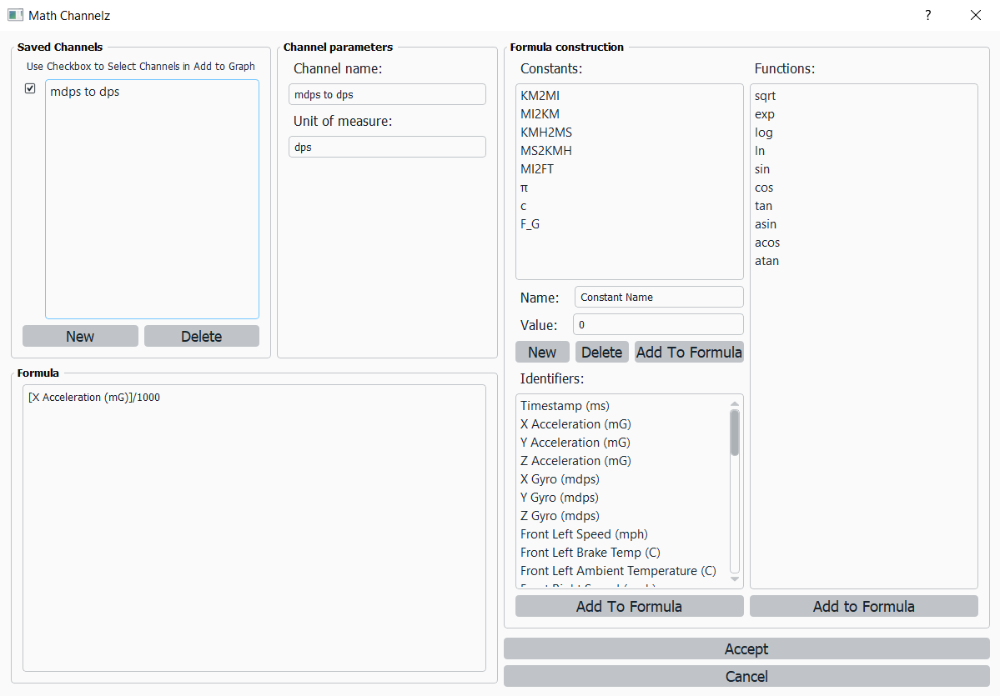

# BetaDash: Real-Time Telemetry Dashboard for ASU FSAE

BetaDash is a modular, real-time telemetry dashboard developed by the Data Acquisition team at Sun Devil Motorsports team. The application is designed to collect, visualize, and analyze vehicle telemetry data both live and post-session.

---

## Features

-  **Real-Time Data Streaming** via serial interface (supports real and simulated data).
- **Dynamic Graphing Interface** using `pyqtgraph` and `matplotlib` with multi-sensor visualization.
- **Math Channel Support** for creating and overlaying derived metrics.
- **Dashboard Saving** to preserve dashboard for future uses
- **Analysis** tools with playback and annotation capabilities.
- **Modular GUI Architecture** powered by `PyQt5`.

---

## Tech Stack

- **GUI Framework:** PyQt5, pyqtswitch, qdarkstyle
- **Plotting:** pyqtgraph, matplotlib
- **Data Handling:** pandas, numpy, sympy
- **Serial Communication:** pyserial
- **File Storage / Saving:** pickle, SQLite

---

## Installation

### 1. Clone the Repository
```
git clone https://github.com/sundevilmotorsports/BetaDash.git
cd BetaDash
```

### 2. Set Up Environment
```
pip install -r requirements.txt
```

### 3. Running the Application
```
python dash_board.py
```

## Photos / Example Uses
### 1. Receiving Live Data (Fake Data)


### 2. Reviewing Data Captured Through Telemetry/Logger


### 3. Creating Math Channels
